# Art Bistro
# Project Portfolio 1 - HTML & CSS

(Developed by Lawrence West)

https://rickback68.github.io/art_bistro/

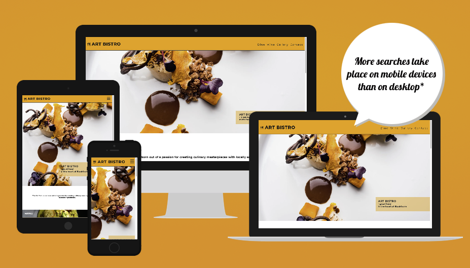

## Table of Content

1. [Project Goals](#project-goals)
    1. [User Goals](#user-goals)
    2. [Site Owner Goals](#site-owner-goals)
2. [User Experience](#user-experience)
    1. [Target Audience](#target-audience)
    2. [User Requrements and Expectations](#user-requrements-and-expectations)
    3. [User Stories](#user-stories)
3. [Design](#design)
    1. [Design Choices](#design-choices)
    2. [Colour](#colours)
    3. [Fonts](#fonts)
    4. [Structure](#site-structure)
    5. [Wireframes](#wireframes)
4. [Technologies Used](#technologies-used)
    1. [Languages](#languages)
    2. [Frameworks & Tools](#frameworks-&-tools)
5. [Features](#features)
     1. [Navigation & Existing Features](#navigation-and-existing-features)
     2. [Future Features](#future-features)

6. [Testing](#code-validation)
    1. [HTML Validation](#HTML-validation)
    2. [CSS Validation](#CSS-validation)
    3. [Accessibility and Performance](#accessibility-and-performance)
    4. [Performance](#accessibility)
    5. [Device testing](#device-testing)
    6. [Browser compatibility](#browser-compatability)
    7. [Testing user stories](#testing-user-stories)
8. [Bugs](#Bugs)
9. [Deployment](#deployment)
10. [Credits](#credits)
11. [Acknowledgements](#acknowledgements)

## Project Goals

This web site project for Art Bistro is designed to showcase the culinary excellence and artistic flair that the restaurant has to offer. With a focus on fusion cuisine inspired by European and Scandinavian flavors, Art Bistro provides a unique dining experience for foodies and fine dining enthusiasts alike.

The website features an array of information for potential customers, including the restaurant's concept,menu offerings, wine selections, a gallery, and contact information. Users can easily navigate through the website to find what they are looking for, whether it be enquiring about a table, exploring the gallery of dishes, checking opening hours, or following Art Bistro on social media.

Through user stories for Art Bistro customers, we have identified the needs and expectations of potential visitors to the website. By addressing these user stories, we aim to provide a seamless and informative experience for users interested in dining at Art Bistro.

Overall, our goal with this web site project is to showcase the unique culinary offerings of Art Bistro Restaurant & Winebar and entice customers to visit and indulge in a culinary journey unlike any other in Stockholm. Welcome to Art Bistro – where dining is not just about nourishment, but also about experiencing art in every bite. Bon appétit!

### User Goals
- Finding a restaurant that offers a nice atmosphere and modern fusion food.
- See a full menu with clear pricing.
- Find information about the restaurants opening hours.
- Find the location and see som pictures of the restaurant

### Site Owner Goals
- Increase in the number of customers.
- Promote the bussines.
- Provide a way for new and existing customers to contact the buissnes.
- Provide essential information about the bussines to customers.

## User Experience

### Target Audience
- Foodies and fusion kitchen lovers.
- Local, visiters and tourists looking for good food in Stockholm
- People looking to induge in an food experience
- Groups of people wanting to find a cozy local bistro to meet up at.

### User Requrements and Expectations

- A simple and intuitive navigation system
- Quickly and easily find relevant information
- Links and functions that work as expected
- Good presentation and a visually appealing design regardless of screen size
- An easy way to contact the bussines
- Simple content that the user can skim read
- Accessibility

### User Stories

#### First-time User

1. Location: 
As a first-time user, I want to easily locate the restaurant.

2. Pricing: 
As a first-time user, I want to know the price range of the restaurant.

3. Information: 
As a first-time user, I want to learn more about the restaurant.

4. Expectations: 
As a first-time user, I want to get a sense of what to expect at the restaurant.

#### Returning User

5. Opening Times: 
As a returning user, I want to know the restaurant's operating hours.

6. Reservation: 
As a returning user, I want to find a contact number for making reservations.

7. Menu: 
As a returning user, I want to see the restaurant's current menus.

8. Feedback:
As a returning user, I want to leave some comment, feedback or a message to the staff

9. Social Media: 
As a returning user, I want to easily find the restaurant on social media platforms to follow.

10. Directions: 
As a returning user, I want to get directions to the restaurant or a map.

#### Site Owner

11. Introduction: 
As the site owner, I want users to get acquainted with the restaurant.

12. Contact: 
As the site owner, I want users to have easy access to contact us.

## Design

### Design Choices
The webpage was designed with warm colorsthe feeling a customer might get while dining at the restaurant. It is calm, warm and inviting. 

### Colours
For the colour sheme Orange tones were chosen to match the images on the page and make the page "pop" and "burst" with color and contrast.

### Fonts

The fonts used in this page are "Montserrat" and "Oswald" from Google Fonts.

### Site Structure

The page is structured in a well know, recognizable, user friendly, and easy to learn way. Upon arriving to the website the user sees a familiar type of navigation bar with the restaurant logo on the left side and the navigation links to the right. 
The website consists of five separate pages: 
- A start page bursting with color
- A menu page
- A Wine list and drinks page
- An image gallery with images and video showcasing the general feel of the restaurant
- A contact page with a contact form and a map with location. 

The website structure includes a header, main content section, and a footer for easy navigation and access to important information and includes the following components:

- Head section with meta tags for SEO optimization, tab title, favicon links, and CSS file link.
- Body section with:
Header containing logo, navigation menu, and burger icon for mobile view.
- Main section with welcome message, presentation sections for menu, wine, and night life, and a section talking about the bistro.
- Footer section with opening hours, contact information, address, and social media links.

### Wireframes 
Enter pictures 

## Technologies Used

### Languages
- HTML
- CSS

### Frameworks & Tools
- Git
- GitHub
- Gitpod
- JPG to WEBP Converter
- Miro
- Google Fonts
- Font Awsome
- Favicon.io

#### Imagery Used

#### Typography 

## Features 

### Navigation and Existing Features

The page consists of 6 essential pages and typical well know features in a webpage:
- index.html
- dine.html
- wine.html
- gallery.html
- contact.html
- style.css
- READme.md

__Logo & Navigation Bar__

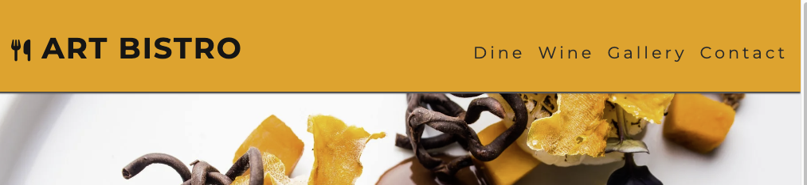

Featured on all pages, the responsive navigation bar allows users to easily navigate through the website, providing links to different sections like Dine, Wine, Gallery, and Contact.
Users can easily move between different sections of the website without getting lost, enhancing the user experience.

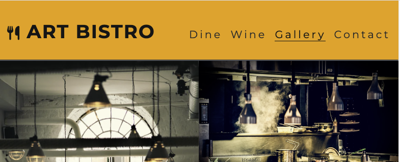

- The navbar is fully responsive and changes to a toggler (hamburger menu) on smaller screens and includes
links to the Homepage, About page, Menu page, Gallery and Contact us page
- It allows users to easily navigate the page
- The link for the page the user is currently on is highlighted 

- Just press the area around the logo and the text Art Bistro at any time to go back to the start page index.html.

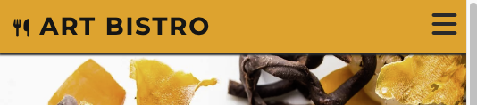

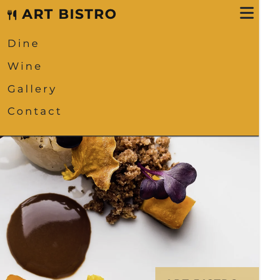

- User stories covered:

__Welcome Section__

The welcome section with an image and text provides users with an introduction to Art Bistro, showcasing the essence of the restaurant.
Users get a visual representation of the restaurant's ambiance and offerings, creating anticipation and interest.
The bottom of the section also contains an About Us section that gives users insight into the ethos and specialties of Art Bistro, creating a connection with potential diners.
Users can understand the uniqueness of Art Bistro's offerings, making them more inclined to visit and experience the restaurant.
- User stories covered:

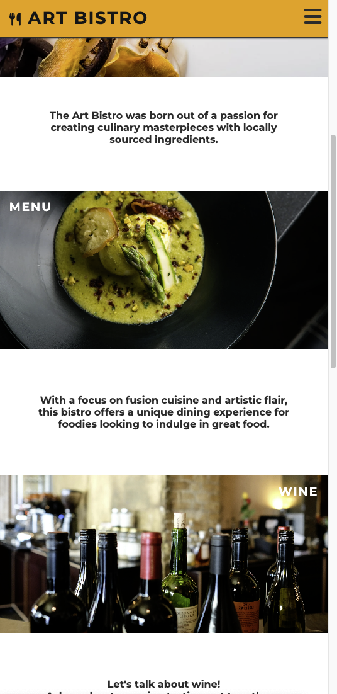

__Menu Navigation__

Links in the main body of the index page link to the food and wine menu and allows users to explore the offerings of Art Bistro in detail.
Users can easily access the menu sections they are interested in from the top also, making it convenient for them to browse through the options.

About Us Section

The about section near the end of the index page give the veiwer an sight to the restaurant vision and intentions. Also close to the footer with further info about hours, location and socialmedia clicks.

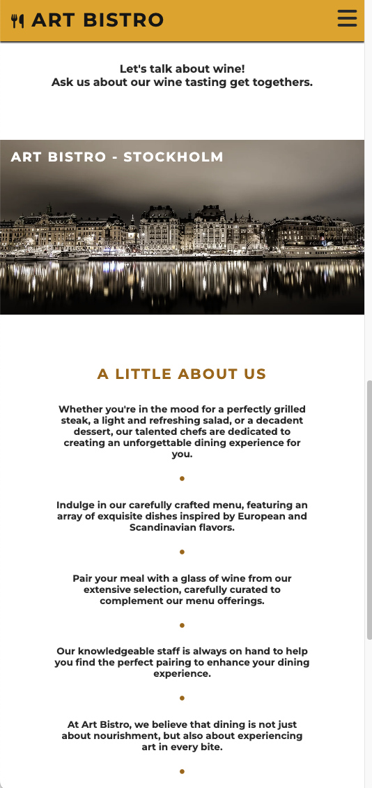
- User stories covered:

(insert picture)

___Food Menu__
- Gives an overview of the menu in five sections: starters, main meals, kids meals, dessers, and wine.
- Each section of the menu is accompanied with an image of one of the items form the menu
- Features pricing
- User stories covered:

(insert picture)

__Wine List and other drinks__
- Gives an overview of the menu in five sections: starters, main meals, kids meals, dessers, and wine.
- Each section of the menu is accompanied with an image of one of the items form the menu
- Features pricing
- User stories covered:

(insert picture)

Footer

___Footer Section__

The footer section provides essential information like opening hours, contact details, and location, enabling users to get in touch or visit Art Bistro easily.
Users can find relevant information quickly, enhancing their overall experience and engagement with the restaurant.
- Featured on all five pages
- Consists of four sections: 

Hours
- Business hours

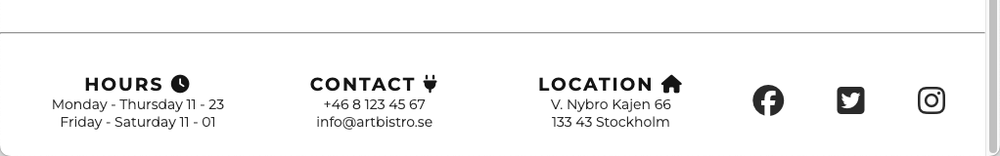

Contact 
 - lights up orange when hovered and links to contact page when clicked.

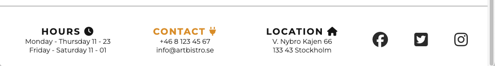

Location 
 - lights up orange when hovered and gives you linked action to the map on contacts page when clicked.

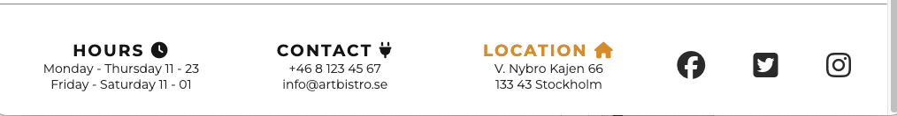

Social Network icons
- turn orange on hover and opens a new page. 

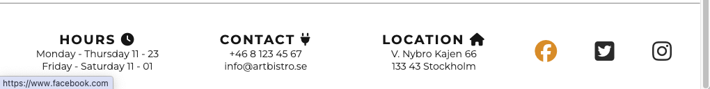

__Gallery__

The gallery page displays images of the restaurant's ambiance and dishes, giving users a visual representation of what to expect.
Users can visually explore Art Bistro's offerings, making an informed decision about visiting the restaurant.

- Imagery of the restaurant arranged in a grid. 1 column for phones and the 2 or three columns depending on the largers size. 

- User stories covered: 4

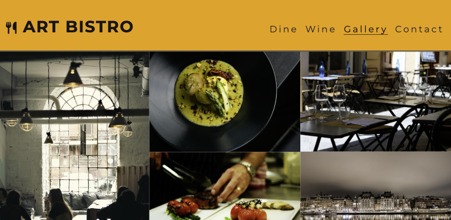

___Contact Form__

The contact form allows users to reach out to Art Bistro for inquiries, reservations, or feedback, enhancing communication.
Users can easily get in touch with the restaurant, leading to improved customer engagement and satisfaction.

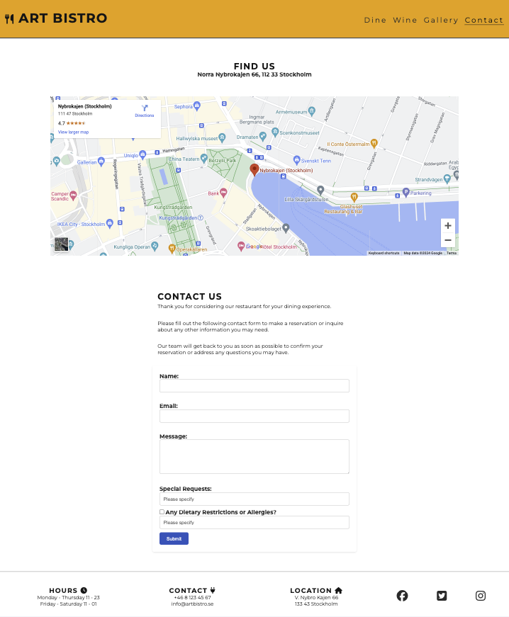

___Map__

- Shows the restaurant location on an embeded Google Map

### Future Features
__Features Left to Implement__

- Online Reservation System
Implementing an online reservation system would allow users to book tables directly through the website, enhancing convenience.
Users can make reservations seamlessly, improving the overall dining experience at Art Bistro.

#### Testing

## Code Validation

### HTML Validation
The HTML of the website was validated using the W3C Markup Validation Service, and all pages passed without any errors or warnings.

Index html

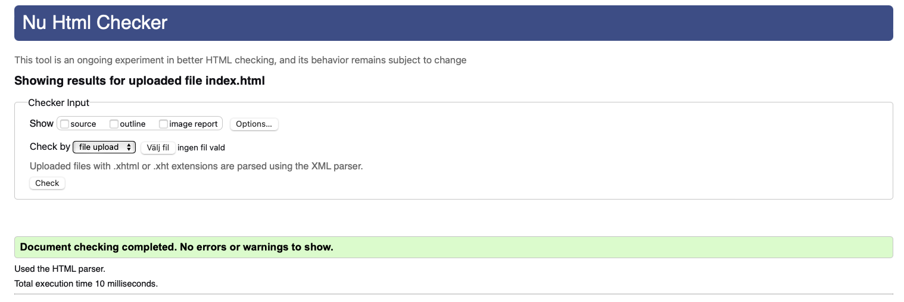

Dine html

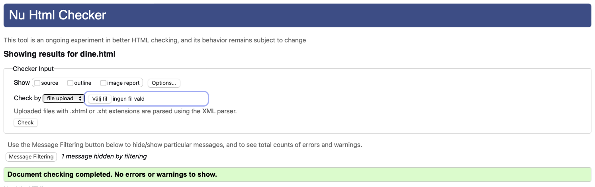

Wine htlm

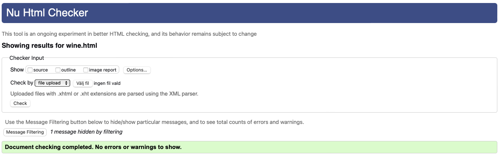

Gallery html

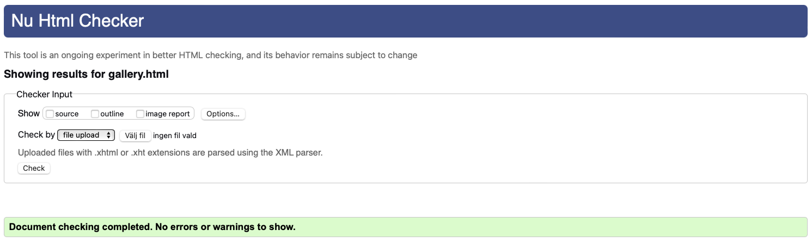

Contact html

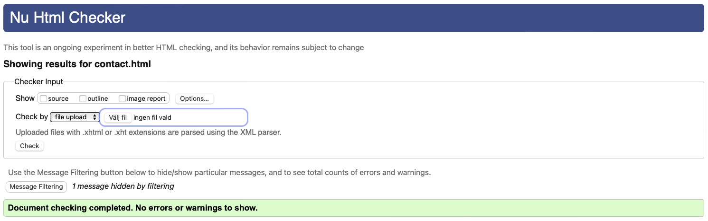

### CSS Validation
The website's CSS was checked for accuracy using the W3C Jigsaw CSS Validation Service.
Although a few human factor errors that were corrected it passsed without any errors.

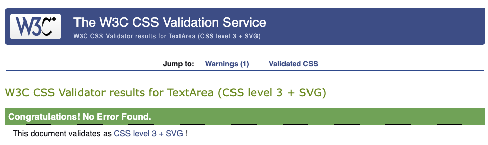

### Accessibility and Performance

#### Accessibility

- Google Lighthouse in Google Chrome Developer Tools was used to test the accessibilty of the website. Please see screenshots below for shared results.

#### Performance

- Google Lighthouse was also used to test the performance of the website with success. Please see screenshots below for shared results.

Index html

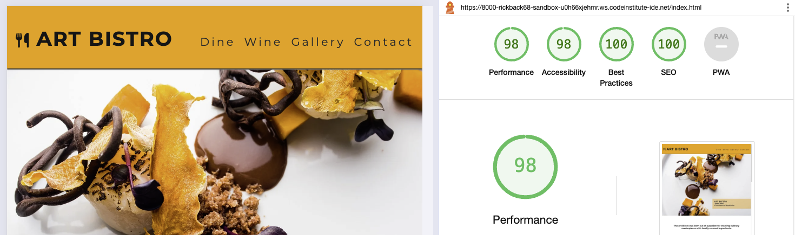

Dine html

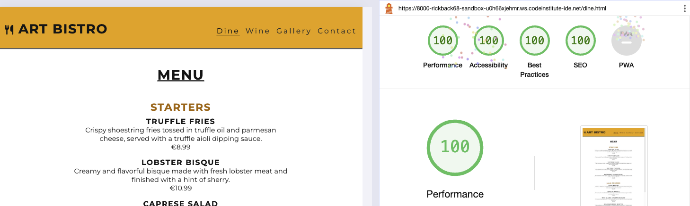

Wine html

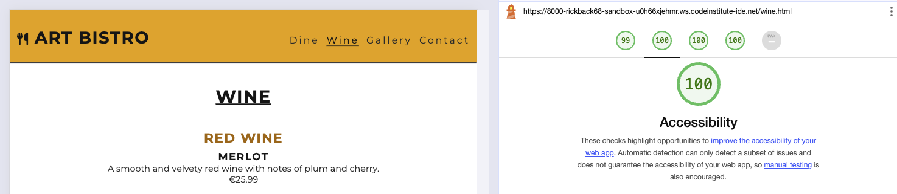

Gallery html

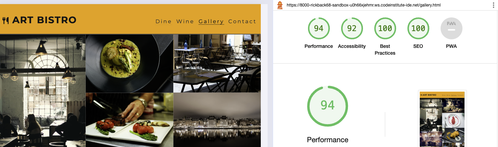

Contact html

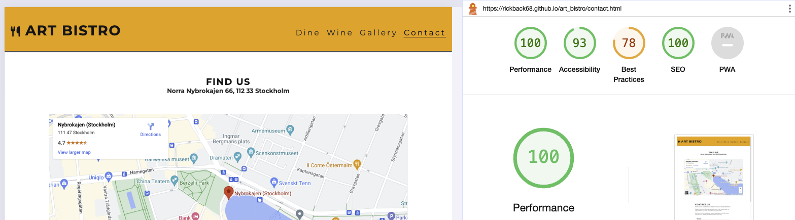

### Device Testing
The website was tested on the following devices with success:
- Macbook Pro M1
- Samsung S20 phone
- Iphone 11

### Browser compatability
The website was tested on the following browsers with success:
- Google Chrome
- Mozilla Firefox
- Microsoft Egde
- Duckagogo

#### Testing user stories

1. As a first-time user, I want to easily locate the restaurant.

| **Feature** | **Action** | **Expected Result** | **Actual Result** |
|-------------|------------|---------------------|-------------------|
| Map | Navigate to the Contact Us page, locate the Google Map | Locating a map showing the location of the restaurant | Works as expected |
| Footer - contact information section | On any page scroll down to the footer | Find the address of the restaurant | Works as expected |

2. As a first-time user, I want to know the price range of the restaurant.

| **Feature** | **Action** | **Expected Result** | **Actual Result** |
|-------------|------------|---------------------|-------------------|
| Menu | Navigate to the Menu and Wine pages | See prices on pages | Works as expected |

3. As a first-time user, I want to learn more about the restaurant.

| **Feature** | **Action** | **Expected Result** | **Actual Result** |
|-------------|------------|---------------------|-------------------|
| About Us | A section at the bottom of the index page i dedicated to About Us | Find description of the restaurant | Works as expected |

4. As a first-time user, I want to get a sense of what to expect at the restaurant.

| **Feature** | **Action** | **Expected Result** | **Actual Result** |
|-------------|------------|---------------------|-------------------|
| Gallery | Navigate to the Gallery page | Find pictures of the restaurant and food served there | Works as expected |

5. As a returning user, I want to know the restaurant's operating hours.

| **Feature** | **Action** | **Expected Result** | **Actual Result** |
|-------------|------------|---------------------|-------------------|
| Footer - opening hours section | On any page scroll to the footer | See opening hours | Works as expected |

6. As a returning user, I want to find a contact number for making reservations.

| **Feature** | **Action** | **Expected Result** | **Actual Result** |
|-------------|------------|---------------------|-------------------|
| Footer - contact information section | On any page scroll to the footer | See phone number | Works as expected |

7. As a returning user, I want to see the restaurant's menus.

| **Feature** | **Action** | **Expected Result** | **Actual Result** |
|-------------|------------|---------------------|-------------------|
| Menu | Navigate to the Dine or Wine menu page | Read the menus | Works as expected |

8. As a returning user, I want to leave some comment, suggestion or message to the staff

| **Feature** | **Action** | **Expected Result** | **Actual Result** |
|-------------|------------|---------------------|-------------------|
| Contact Form | Navigate to the Contact Us Page and locate the contact form, fill out and submit contact form | Data submited via contact form | Works as expectd |

9. As a returning user, I want to easily find the restaurant on social media platforms to follow.

| **Feature** | **Action** | **Expected Result** | **Actual Result** |
|-------------|------------|---------------------|-------------------|
| Footer - social media section | On any page scroll to the bottom | Click on social media links | Works as expected | 

10. As a returning user, I want to get directions to the restaurant or a map.

| **Feature** | **Action** | **Expected Result** | **Actual Result** |
|-------------|------------|---------------------|-------------------|
| Map | Navigate to the Contact Us page, locate the map and click on directions link | See directions to the restaurant on Goole Maps | Works as expected |

11. As the site owner, I want users to get acquainted with the restaurant.

| **Feature** | **Action** | **Expected Result** | **Actual Result** |
|-------------|------------|---------------------|-------------------|
| First page | Navigate and scroll through pages to get to know the concept and feel of the restaurant | See relevant information about the restaurant | Works as expected |

12. As the site owner, I want users to have easy access to contact us.

| **Feature** | **Action** | **Expected Result** | **Actual Result** |
|-------------|------------|---------------------|-------------------|
| Contact Form | Navigate to the Contact Us Page and locate the contact form, fill out and submit contact form | Data submited via contact form | Works as expectd |
| Footer - contact information section | On any page scroll down to the footer | Find the phone number and email address| Works as expected |

##### Bugs?
## Bugs

| **Bug** | **Fix** |
| ----------- | ----------- |
| Sometimes there is a glich in the logo between | Change active atribute to the correct page |
| 

### Unfixed Bugs

You will need to mention unfixed bugs and why they were not fixed. This section should include shortcomings of the frameworks or technologies used. Although time can be a big variable to consider, paucity of time and difficulty understanding implementation is not a valid reason to leave bugs unfixed. 

## Deployment

- The site was deployed to GitHub pages. The steps to deploy are as follows: 
  To deploy the website using GitHub Pages, follow these steps:

In the GitHub repository, I went to the Settings tab.
I selected Pages from the menu on the left.
- Under Build and deployment / Source
Choose main and root under Branch and save.
After the webpage refreshes, it will show "Your site is published 

The live link can be found here - https://rickback68.github.io/art_bistro/

## Credits 

- The HTML for the responsive [Navbar with toggler]was taken from CI Love Running project lessons. 

### Content 

- The icons in the footer were taken from [Font Awesome](https://fontawesome.com/)

### Media

- The photos used on the home and sign up page are from https://Pixabay.com and royalty free 

## Acknowledgements
I would like to take the opportunity to thank:

